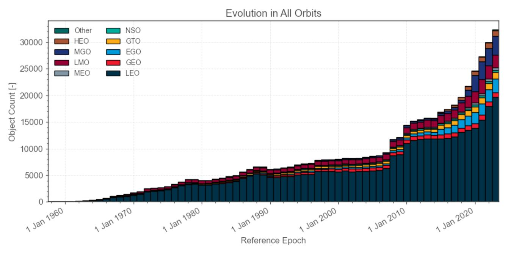

# 1. Análisis y Visualización

  

En la primer parte, se busca comprender el conjunto de datos y familiarizarse con las variables disponibles en los diferentes archivos: número de satélites, tipo de misión, vida útil estimada, tipo de órbita, país o entidad responsable, fecha de lanzamiento, entre otros. 

Se realizará una primera exploración para entender la cantidad y calidad de los datos. 

Se identificarán variables clave, como aquellas relacionadas con la duración funcional de los satélites o el estado actual (activo/inactivo), y se evaluará si hay suficiente información histórica para plantear modelos predictivos.

Se generarán visualizaciones que permitan identificar tendencias, distribuciones y posibles correlaciones entre variables. Esto ayudará a dimensionar el crecimiento del número de objetos en órbita, clasificar por tipo de objeto (satélite funcional o desecho), y analizar su evolución en el tiempo.

Sugerencias para el análisis:
- ¿Cuál es la relación entre el tamaño del objeto y su tipo de órbita?
- ¿Cuántos objetos existen según su tipo?
- Comprender el significado de valores nulos: ¿son realmente "faltantes" o tienen un significado particular?
- ¿Cuáles son las variables que podrían tener mayor influencia en la vida útil o el estado operativo?
- Determinar la correlación entre variables e identificar patrones 
- ¿Qué porcentaje del dataset contiene datos faltantes? ¿Se pueden imputar?
- ¿Qué hipótesis se pueden plantear para validar en etapas posteriores?
- ¿Qué tipo de gráficos aportan más información según la variable a analizar? 
- ¿Se observa una evolución distinta entre diferentes tipos de órbitas?
- ¿Hay países más propensas a generar desechos?

##

Siguiente | <b><a href="analisis_exploratorio.md">Análisis Exploratorio y Curación de Datos</a></b>
 
Atrás | <b><a href="dataset.md">Descripción de los Datos</a>

</b>
 EnzoRg | <a href="../README.md">Contenidos</a>
